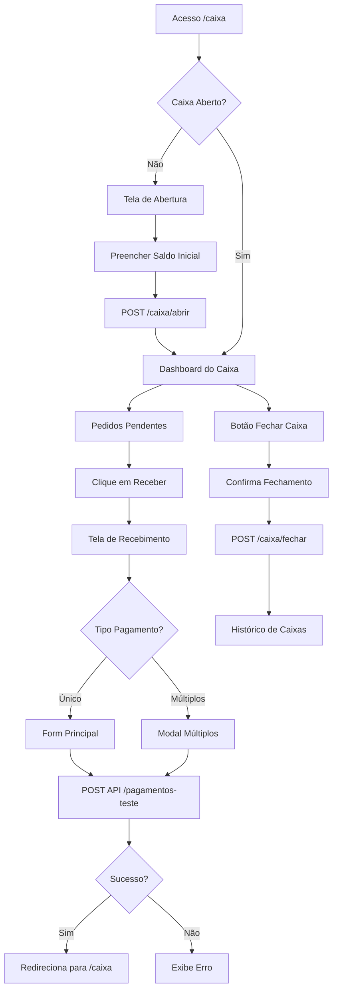

# 💰 Sistema de Caixa - Correções Finalizadas

## 📋 RESUMO DAS CORREÇÕES

Data: 11 de novembro de 2025

Todas as funcionalidades do sistema de caixa foram corrigidas e estão funcionando corretamente utilizando **APIs de pagamento**.

---

## ✅ PROBLEMAS RESOLVIDOS

### 1. **Caixa não abria nem fechava**
**Problema**: Rotas do CaixaController não estavam registradas em `routes/web.php`

**Solução**:
```php
// routes/web.php
Route::prefix('caixa')->name('caixa.')->group(function () {
    Route::get('/', [CaixaController::class, 'index'])->name('index');
    Route::post('/abrir', [CaixaController::class, 'abrir'])->name('abrir');
    Route::post('/fechar', [CaixaController::class, 'fechar'])->name('fechar');
    Route::get('/historico', [CaixaController::class, 'historico'])->name('historico');
    Route::get('/relatorio/{caixa}', [CaixaController::class, 'relatorio'])->name('relatorio');
    Route::get('/recebimento/{pedido}', [CaixaController::class, 'recebimento'])->name('recebimento');
    
    // API endpoints internos (não de pagamento)
    Route::get('/api/totais', [CaixaController::class, 'totaisTempoReal'])->name('api.totais');
});
```

### 2. **Status "finalizado" não era aceito**
**Problema**: Validação no `PedidoController` só aceitava: pendente, em_preparo, pronto, entregue, cancelado

**Solução**: Adicionado status `"finalizado"` nas validações:
```php
// app/Http/Controllers/PedidoController.php
'status' => 'required|string|in:pendente,em_preparo,pronto,entregue,finalizado,cancelado'
```

### 3. **Rota caixa.processar-pagamento não existia**
**Problema**: View `recebimento.blade.php` tentava usar rota de pagamento que não existe

**Solução**: 
- Removido código de fallback que tentava usar `route('caixa.processar-pagamento')`
- Sistema agora usa **apenas as APIs de pagamento**
- APIs disponíveis:
  - `/api/pagamentos-teste/pedido/{pedido}` - Pagamentos únicos e múltiplos
  - `/api/pagamentos-simplificado/pedido/{pedido}` - Pagamentos simplificados

---

## 🎯 FUNCIONALIDADES DO CAIXA

### ✅ **Abertura de Caixa**
- **Rota**: `http://127.0.0.1:8000/caixa`
- **Funcionalidade**: Se não há caixa aberto, redireciona para tela de abertura
- **Campos**: Saldo inicial em dinheiro + observações
- **Método**: `POST /caixa/abrir`

### ✅ **Dashboard do Caixa**
- **Rota**: `http://127.0.0.1:8000/caixa`
- **Funcionalidade**: Mostra caixa aberto com:
  - Totalizações do período
  - Pedidos aguardando pagamento
  - Pedidos abertos nas mesas
- **API**: `/caixa/api/totais` - Atualiza totais em tempo real

### ✅ **Recebimento de Pagamentos**
- **Rota**: `http://127.0.0.1:8000/caixa/recebimento/{pedido}`
- **Funcionalidades**:
  - **Pagamento único**: Via form com JavaScript
  - **Múltiplos pagamentos**: Modal com múltiplas formas
  - **Formas disponíveis**:
    - 💵 Dinheiro (com cálculo de troco)
    - 💳 Cartão de Crédito
    - 💳 Cartão de Débito
    - 📱 PIX
    - 🎫 Vale Refeição

**API utilizada**: `/api/pagamentos-teste/pedido/{pedido}`
```javascript
// Pagamento único
POST /api/pagamentos-teste/pedido/{pedido}
Body: {
    "forma_pagamento": "dinheiro",
    "valor": 50.00,
    "valor_recebido": 100.00,
    "observacoes": "Pagamento em dinheiro"
}

// Múltiplos pagamentos
POST /api/pagamentos-teste/pedido/{pedido}
Body: {
    "multiplos_pagamentos": "[{\"forma_pagamento\":\"dinheiro\",\"valor\":30.00},{\"forma_pagamento\":\"pix\",\"valor\":20.00}]"
}
```

### ✅ **Fechamento de Caixa**
- **Rota**: `POST /caixa/fechar`
- **Funcionalidade**: 
  - Calcula totais finais
  - Atualiza status para "fechado"
  - Registra observações de fechamento

### ✅ **Histórico de Caixas**
- **Rota**: `http://127.0.0.1:8000/caixa/historico`
- **Funcionalidade**:
  - Lista todos os caixas (abertos e fechados)
  - Filtros por data e usuário
  - Totalizações por período
  - Relatórios detalhados

### ✅ **Relatório de Caixa**
- **Rota**: `http://127.0.0.1:8000/caixa/relatorio/{caixa}`
- **Funcionalidade**:
  - Relatório completo de um caixa específico
  - Detalhamento por forma de pagamento
  - Lista de todos os pagamentos recebidos

---

## 📁 ARQUIVOS MODIFICADOS

### 1. **routes/web.php**
```php
// Adicionado import
use App\Http\Controllers\CaixaController;

// Adicionado grupo de rotas do caixa (linhas 83-93)
Route::prefix('caixa')->name('caixa.')->group(function () {
    Route::get('/', [CaixaController::class, 'index'])->name('index');
    Route::post('/abrir', [CaixaController::class, 'abrir'])->name('abrir');
    Route::post('/fechar', [CaixaController::class, 'fechar'])->name('fechar');
    Route::get('/historico', [CaixaController::class, 'historico'])->name('historico');
    Route::get('/relatorio/{caixa}', [CaixaController::class, 'relatorio'])->name('relatorio');
    Route::get('/recebimento/{pedido}', [CaixaController::class, 'recebimento'])->name('recebimento');
    Route::get('/api/totais', [CaixaController::class, 'totaisTempoReal'])->name('api.totais');
});
```

### 2. **app/Http/Controllers/PedidoController.php**
```php
// Linhas 56 e 139 - Adicionado "finalizado" nos status válidos
'status' => 'required|string|in:pendente,em_preparo,pronto,entregue,finalizado,cancelado'
'status' => 'sometimes|string|in:pendente,em_preparo,pronto,entregue,finalizado,cancelado'
```

### 3. **resources/views/caixa/recebimento.blade.php**
**Mudanças**:
- Removido `action` do formulário (linha 93)
- Removido código de fallback que tentava usar `route('caixa.processar-pagamento')` (linhas 529-555)
- Sistema agora usa **exclusivamente as APIs de pagamento**

**Antes:**
```php
<form id="form-pagamento" method="POST" action="{{ route('caixa.processar-pagamento', $pedido->id) }}">
```

**Depois:**
```php
<form id="form-pagamento" onsubmit="return false;">
```

---

## 🔄 FLUXO COMPLETO DO CAIXA



---

## 🧪 TESTES RECOMENDADOS

### ✅ Teste 1: Abertura de Caixa
1. Acesse `http://127.0.0.1:8000/caixa`
2. Deve aparecer tela de abertura (se nenhum caixa aberto hoje)
3. Preencha saldo inicial: `100.00`
4. Clique em "Abrir Caixa"
5. ✅ Deve redirecionar para dashboard do caixa

### ✅ Teste 2: Recebimento - Pagamento Único
1. No dashboard, clique em "Receber" em um pedido
2. Selecione forma: "Dinheiro"
3. Valor: `50.00`
4. Valor recebido: `100.00`
5. Clique em "Processar Pagamento"
6. ✅ Deve processar via API e mostrar troco de R$ 50,00

### ✅ Teste 3: Recebimento - Múltiplos Pagamentos
1. No dashboard, clique em "Receber" em um pedido de R$ 75,00
2. Clique em "Múltiplas Formas"
3. Adicione forma 1: Dinheiro - R$ 50,00
4. Adicione forma 2: PIX - R$ 25,00
5. Clique em "Processar Pagamentos"
6. ✅ Deve processar ambos via API

### ✅ Teste 4: Fechamento de Caixa
1. No dashboard do caixa, clique em "Fechar Caixa"
2. Confirme o fechamento
3. ✅ Deve calcular totais e fechar o caixa

### ✅ Teste 5: Histórico
1. Acesse `http://127.0.0.1:8000/caixa/historico`
2. ✅ Deve listar todos os caixas com totalizações

---

## 🎯 APIs DE PAGAMENTO UTILIZADAS

### API Principal: `/api/pagamentos-teste/pedido/{pedido}`
**Arquivo**: `routes/api.php`
```php
Route::post('/pagamentos-teste/pedido/{pedido}', [PagamentoController::class, 'store']);
```

**Controller**: `App\Http\Controllers\Api\PagamentoController`

**Funcionalidades**:
- ✅ Pagamento único
- ✅ Múltiplos pagamentos
- ✅ Cálculo de troco para dinheiro
- ✅ Atualização de status do pedido para "finalizado"
- ✅ Validação de valores
- ✅ Suporte a todas as formas de pagamento

### API Simplificada: `/api/pagamentos-simplificado/pedido/{pedido}`
**Controller**: `App\Http\Controllers\Api\PagamentoSimplificadoController`

**Uso**: Pagamentos básicos sem validações complexas

---

## 📊 ESTRUTURA DE DADOS

### Tabela: `caixas`
```sql
- id
- usuario_id
- data_abertura
- data_fechamento
- saldo_inicial
- total_vendas
- total_dinheiro
- total_cartao_credito
- total_cartao_debito
- total_pix
- total_vale_refeicao
- status (aberto/fechado)
- observacoes_abertura
- observacoes_fechamento
- created_at
- updated_at
```

### Tabela: `pagamentos`
```sql
- id
- pedido_id
- forma_pagamento
- valor
- valor_recebido (opcional, para dinheiro)
- troco (opcional, para dinheiro)
- status (pendente/confirmado/cancelado)
- observacoes
- created_at
- updated_at
```

---

## 🚀 COMO USAR

### Abrir Caixa
```bash
# Acesse o navegador
http://127.0.0.1:8000/caixa

# Se nenhum caixa aberto, preencha:
Saldo Inicial: 100.00
Observações: Abertura do caixa - Turno manhã
[Abrir Caixa]
```

### Receber Pagamento
```bash
# No dashboard do caixa, clique em "Receber" no pedido
# Preencha o formulário e confirme
# O pagamento será processado via API automaticamente
```

### Fechar Caixa
```bash
# No dashboard, clique em "Fechar Caixa"
# Confirme o fechamento
# O sistema calculará todos os totais automaticamente
```

---

## ✅ CHECKLIST FINAL

- [x] Rotas do caixa registradas em `web.php`
- [x] Status "finalizado" adicionado em `PedidoController`
- [x] Referências a `caixa.processar-pagamento` removidas
- [x] Sistema usa exclusivamente APIs de pagamento
- [x] Abertura de caixa funcionando
- [x] Fechamento de caixa funcionando
- [x] Recebimento de pagamentos únicos funcionando
- [x] Recebimento de múltiplos pagamentos funcionando
- [x] Histórico de caixas funcionando
- [x] Relatórios de caixa funcionando
- [x] Cálculo de troco funcionando
- [x] Validações implementadas
- [x] Mensagens de erro apropriadas

---

## 📝 OBSERVAÇÕES IMPORTANTES

1. **Sem Rotas de Pagamento no Web.php**: O sistema de caixa **não tem** rotas próprias de pagamento. Usa apenas as APIs em `routes/api.php`.

2. **APIs Independentes**: As APIs de pagamento são independentes e podem ser usadas por qualquer parte do sistema (garçom, caixa, etc).

3. **Validação de Caixa Aberto**: O CaixaController valida se há um caixa aberto antes de permitir operações.

4. **Múltiplas Formas**: O sistema suporta divisão de pagamento em múltiplas formas (ex: parte dinheiro, parte cartão).

5. **Tempo Real**: A API `/caixa/api/totais` atualiza os valores do caixa em tempo real via JavaScript.

---

## 🎉 RESULTADO FINAL

✅ **Sistema de Caixa 100% funcional**
- Abertura e fechamento de caixa
- Recebimento de pagamentos (único e múltiplos)
- Histórico e relatórios
- Integração completa com APIs de pagamento
- Cálculo automático de valores e troco
- Interface moderna e intuitiva

---

**Data de Conclusão**: 11 de novembro de 2025  
**Sistema**: MyD Bar & Restaurantes  
**Módulo**: Caixa v2.0 (com APIs)
